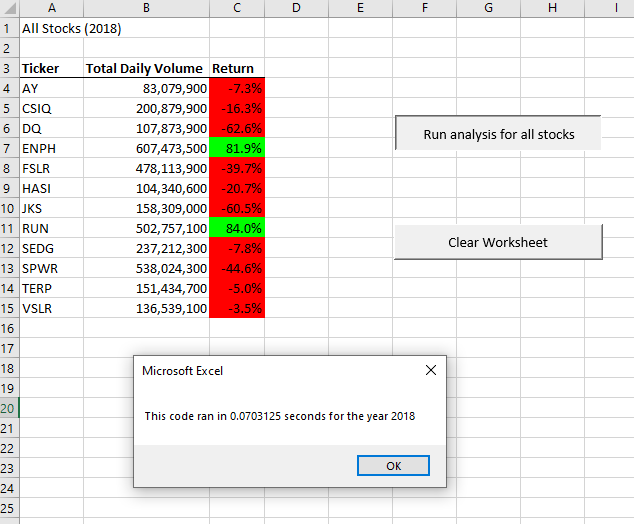

# stock-analysis

## Overview of Project
This project was created in order to help my parents analyze green stocks. My parents were specifically interested in purchasing the DQ stock, therefore an analysis was made using VBA in Microsoft Excel by creating a macro that calculates the total daily volumes and annual return of all green stocks in 2017 and 2018.

## Results
Per my analysis, here are the stock performances for 2017 and 2018:

### 2017 results

### 2018 results

As you can notice, the stocks analyzed had far better return in 2017 than 2018. In fact, most of them had nagative return in 2018 whereas they had positive return in 2017, which is also the case for the DQ stock, which increased close to 200% return in 2017. 

The stocks RUN and ENPH are the only two that have stayed with a positive return in both years, which are therefore worth looking into. 

The volume traded between both years are similar globally.

By refactoring the macro, there is also significant improvement in the time it takes to run the macro. As you can see in the images above, both refactored macros took 0.1 seconds or less to complete. Before the refactoring, both took around 0.5 seconds to complete. 

## Summary
We can summarize the following two things:

1. There are both advantages and disadvantages to refactoring code. An advantage is that they code might be more performant and the computer can run it faster. The disadvantage is that it takes time to refactor code, therefore it might not be worth it if the change in performance is negligeable. 

2. These apply to refactoring the original VBA script because while the script did increase in performance by about 5 times, it took multiple hours to refactor this code. The code only took 0.5 seconds to run in the beginning therefore one could argue that the time lost on improving this code will not be worth the time saved to run the macro. 
